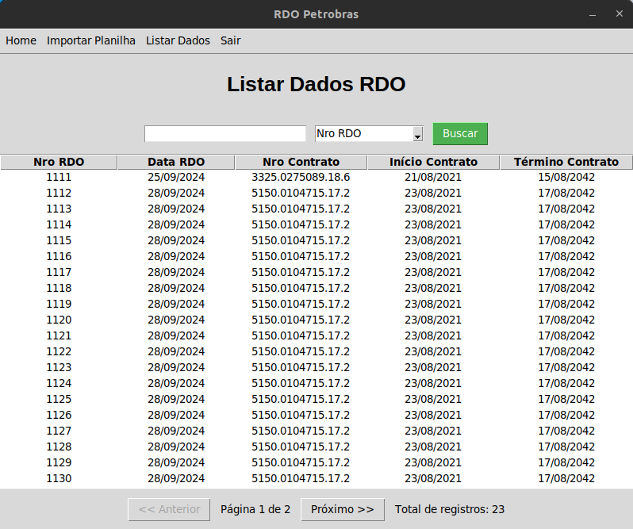

# RDO Petrobras

Este projeto Java permite importar dados de um arquivo Excel para o banco de dados MySQL e exibir os dados em uma interface gráfica.

## Requisitos

- Python 3
- PIP 3
- MySQL 8

## Banco de Dados

1. Crie um banco de dados no MySQL com o nome "rdo_petro".
2. Execute o script SQL em "dump_sql/rdo_petro.sql" para criar as tabelas e campos necessários.

## Instalação

1. Faça o download do projeto.
2. Navegue até a pasta do projeto no terminal.
3. Execute o instalador com o seguinte comando:

Windows:

```
install.bat
```

Linux Ubuntu/Debian:

```
sudo chmod +x install.sh
    
./install.sh
```

## Execução

Para rodar o programa execute o seguinte comando:

```
python main.py
```

## Screenshots

 <br>
 <br>
 <br>
 <br>
 <br>
 <br>
 <br>
 <br>

## Licença

Projeto licenciado sob <a href="LICENSE">The MIT License (MIT)</a>.<br><br>


Desenvolvido por<br>
Danilo Meneghel<br>
danilo.meneghel@gmail.com<br>
http://danilomeneghel.github.io/<br>
